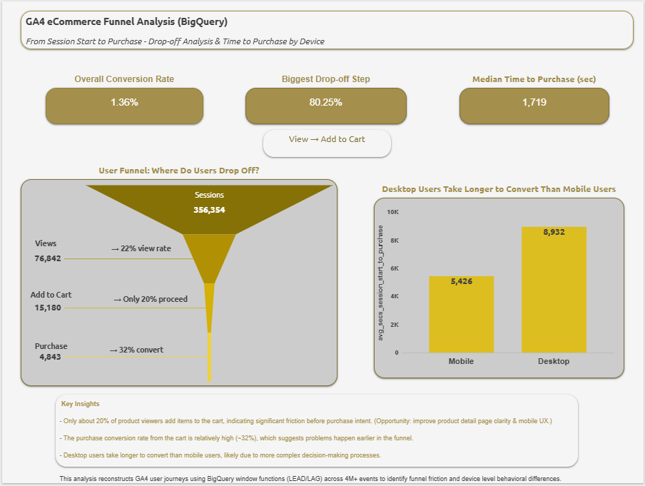
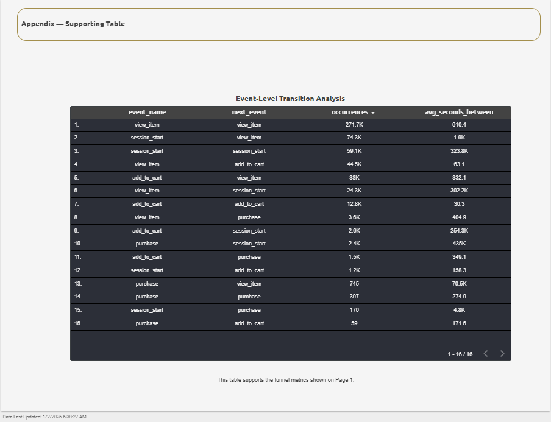

# GA4 eCommerce Funnel Analysis with BigQuery & Looker Studio

## 📊 Dashboard Preview

### 🎬 [▶️ Watch Dashboard Demo Video](https://github.com/emineerdogane/GA4-eCommerce-Funnel-Analysis-BigQuery-Looker-Studio/raw/main/GA4%20Funnel%20Analysis.mp4)

  <a href="https://github.com/emineerdogane/GA4-eCommerce-Funnel-Analysis-BigQuery-Looker-Studio/raw/main/GA4%20Funnel%20Analysis.mp4">
    
     
    <em>👆 Click to watch the interactive dashboard demo</em>
  </a>

## 📈 Overview

This project analyzes Google Analytics 4 (GA4) eCommerce funnel data using BigQuery SQL queries and visualizes insights in Looker Studio. The analysis tracks user behavior through the purchase funnel, identifies drop-off points, and provides actionable insights for conversion optimization.

## 🎯 Key Features

- **Funnel Analysis**: Track user progression through eCommerce stages (view → add_to_cart → checkout → purchase)
- **Event Transitions**: Analyze user behavior patterns and conversion paths
- **Device Performance**: Compare conversion rates across different devices
- **Time-to-Purchase**: Understand customer decision-making timelines
- **Interactive Dashboards**: Visual insights via Looker Studio

## 📊 Dashboard Screenshots

### Funnel Overview

### Event Transitions

## 🔧 SQL Queries

### 1. Funnel Summary (`funnel_summary.sql`)
Calculates conversion rates and drop-off rates at each funnel stage.

### 2. Funnel Data for Visualization (`funnel_data_for_viz.sql`)
Prepares data for Looker Studio visualizations with detailed metrics.

### 3. Event Transitions (`event_transitions.sql`)
Analyzes user flow between different events to identify common paths.

### 4. Device Time to Purchase (`device_time_to_purchase.sql`)
Compares conversion times across mobile, desktop, and tablet devices.

## 🚀 Getting Started

### Prerequisites
- Google Cloud Platform account
- GA4 property with eCommerce tracking enabled
- BigQuery dataset connected to GA4
- Looker Studio access

### Setup
1. Clone this repository
2. Update the BigQuery dataset reference in SQL files to match your project
3. Run the SQL queries in BigQuery
4. Connect Looker Studio to your BigQuery dataset
5. Import the dashboard template

## 📝 Usage

1. **Run SQL Queries**: Execute the queries in BigQuery to generate analysis tables
2. **Create Visualizations**: Use Looker Studio to build interactive dashboards
3. **Monitor Performance**: Track KPIs and identify optimization opportunities
4. **Iterate**: Refine analysis based on business needs

## 📊 Key Metrics Tracked

- Conversion Rate by Stage
- Drop-off Rate Analysis
- Average Time to Purchase
- Device Performance Comparison
- Top Event Transition Paths
- User Engagement Metrics

## 🛠️ Technologies Used

- **Google Analytics 4 (GA4)**: Data collection
- **BigQuery**: Data warehousing and SQL analysis
- **Looker Studio**: Data visualization
- **SQL**: Data transformation and analysis

## 📈 Insights & Findings

This analysis helps identify:
- Critical drop-off points in the purchase funnel
- Device-specific conversion patterns
- Optimal customer journey paths
- Time-sensitive conversion opportunities

## 🤝 Contributing

Contributions are welcome! Please feel free to submit a Pull Request.

## 📧 Contact

For questions or collaboration opportunities, please reach out via GitHub.

## 📄 License

This project is available for educational and commercial use.

---

**Note**: Replace placeholder dataset names and project IDs in SQL files with your actual Google Cloud project details.
